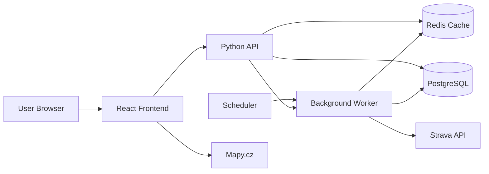
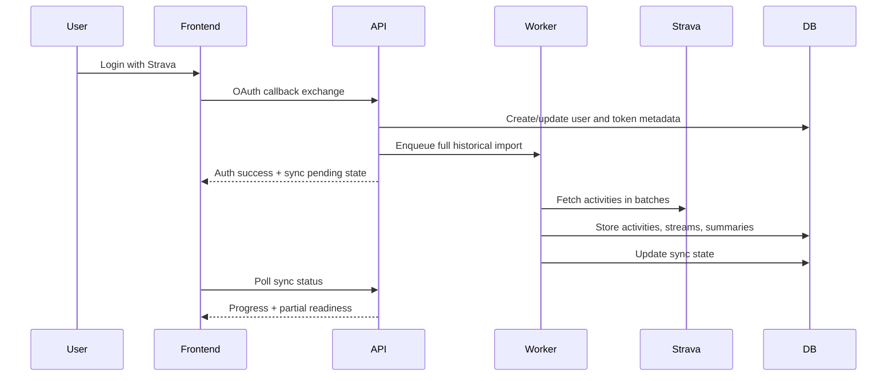
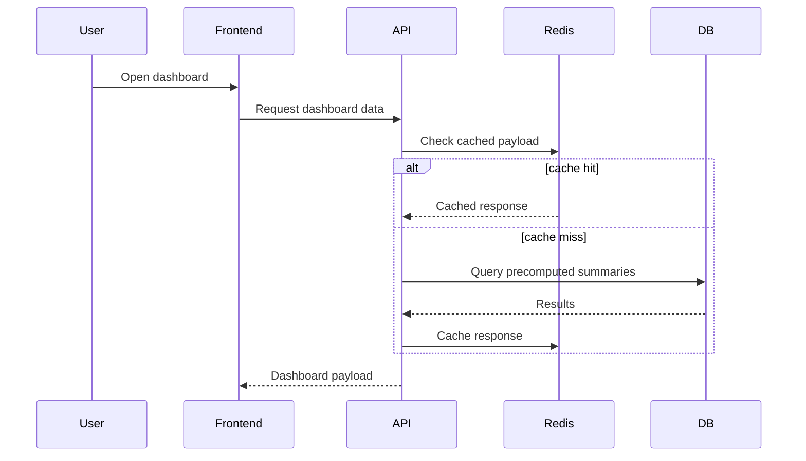
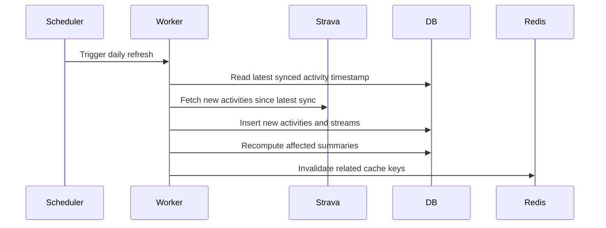
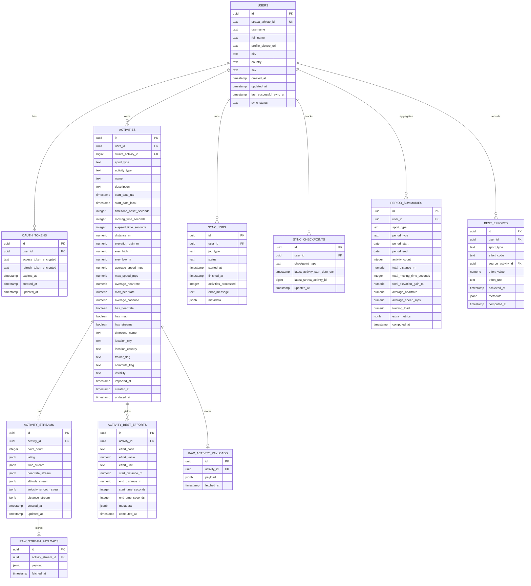

# Strava Insights Rewrite Specification

## Summary

This document defines the target product and architecture for a full rewrite of the current Strava Insights application.

The rewrite keeps the existing product intent and analytical scope, but replaces the current Flask + Dash implementation with a faster, cleaner system designed around:

- local persisted data instead of live Strava reads in the UI path
- asynchronous background imports and refresh jobs
- a dedicated frontend and backend
- sub-500 ms interactive responses from local storage/cache
- a UI redesign with the same core information coverage as the current app

## Product Goals

- Provide hobby athletes with analytics that approximate or extend premium Strava insights.
- Support running and cycling activities only.
- Show long-term progression, best efforts, activity details, and training trends.
- Make the application feel fast in normal usage.
- Preserve the information breadth of the current application while redesigning navigation and UI from scratch.

## Product Scope

### Users

- Multi-user capable architecture.
- Each user authenticates with their own Strava account.
- Strava OAuth is the only authentication mechanism.

### Supported Activity Types

- Run
- Ride
- EBikeRide
- Cycling-related ride variants supported by Strava data and grouped into cycling views where appropriate

### Explicit Product Decisions

- Import the full historical activity set on first connection.
- Persist downloaded data in a local database.
- Use caching on top of persisted storage where it improves latency.
- Do not rely on live Strava API calls for normal page rendering.
- Do not support user-triggered export, disconnect, or deletion flows in v1.
- Do not synchronize historical edits or deletes made later in Strava.
- Mobile-first support is not required; desktop web is the primary target.

## Success Criteria

- Cached and database-backed reads for normal user interactions complete within 500 ms under expected load.
- First-time import runs asynchronously and does not block the application shell.
- The application exposes the same high-level information as the current project.
- The rewritten codebase uses clear separation of concerns and is maintainable for future expansion.

## Recommended Target Stack

### Frontend

- React
- Tailwind CSS
- Recharts for time series and activity detail graphs
- Map integration using Mapy.cz

### Backend

- Python 3.13
- FastAPI backend API
- Separate worker process for background import and refresh jobs
- Scheduled sync process for daily refresh and startup-triggered refresh when applicable
- Celery for background jobs and scheduled refresh execution

### Data Layer

- PostgreSQL as the primary database
- Redis as the cache and short-lived job/state store

## Why PostgreSQL Instead of MongoDB

PostgreSQL is the recommended primary store because the data model is strongly relational:

- users own many activities
- activities own many streams and derived metrics
- sync jobs belong to users
- filters and period comparisons require structured querying

PostgreSQL also makes it easier to:

- query by sport type and date ranges efficiently
- maintain user isolation
- store normalized summaries and raw payload references
- evolve analytics logic over time without ad hoc document shapes

MongoDB is viable, but it is not the preferred fit for the product requirements gathered so far.

## High-Level Architecture



## Core Architectural Principles

- UI reads only from local storage/cache, not directly from Strava.
- Background jobs handle first import and later syncs.
- Backend services are separated by responsibility: auth, sync, analytics, read APIs.
- Domain logic is deterministic and testable outside the HTTP framework.
- Raw imported data and normalized analytical data are stored separately where practical.

## Main User Flows

### 1. First Login and Historical Import



### 2. Normal Dashboard Load



### 3. Scheduled Refresh



## Functional Scope

### Pages and Screens

The rewrite keeps the same information coverage as the current project, but the navigation and layout can change completely.

Required screens:

- landing/login page with Strava OAuth entry
- authenticated home/dashboard page
- activity calendar view
- activity detail experience with map and graphs
- profile/settings page
- sync/import status state for initial import and later refreshes

### Mandatory Analytics

- progression over time
- speed trends
- elevation trends
- training load or difficulty trend
- best efforts
- yearly, monthly, and rolling-period comparisons
- single-activity analysis

### Best Effort Requirements

Running best efforts should include at minimum:

- best 1 km
- best 5 km
- best 10 km
- longest run
- biggest elevation gain

Cycling best efforts should include at minimum:

- longest ride
- fastest ride-oriented effort metrics where data quality supports them
- biggest elevation gain

The implementation should keep room for additional best-effort definitions without redesigning storage.

### Filters

Required v1 filters:

- sport type
- date range

No additional filter dimensions are required in v1.

### Visual Detail on Activity Screen

Required activity detail elements:

- route map using Mapy.cz
- heart rate visualization where data exists
- pace or speed graph
- elevation profile
- slope or gradient view if available from current logic
- activity KPIs
- single-activity interval/effort analysis

## UX Requirements

### General

- Desktop web experience is primary.
- UI can be redesigned from scratch.
- Users should be able to access the app shell even while initial import is still running.
- The app should clearly communicate when data is still syncing.

### Desired Experience

- Fast dashboard loads from local read models
- Clear distinction between current data and sync status
- Dense but readable analytics layout
- Quick navigation between dashboard, calendar, activity detail, and profile/settings

## Proposed Information Architecture

### Navigation

- Dashboard
- Calendar
- Activities
- Best Efforts
- Settings/Profile

### Suggested Page Breakdown

- Dashboard: headline metrics, trend charts, period comparisons, best-effort highlights
- Calendar: training calendar with activity drilldown
- Activities: searchable/filterable activity list leading to detail page
- Activity Detail: route, KPIs, stream charts, interval analysis
- Best Efforts: dedicated summary page for key PR-style metrics
- Settings/Profile: athlete profile, sync metadata, preferences if kept from current logic

## Wireframes

### 1. Landing / Login

```text
+---------------------------------------------------------------+
| Strava Insights                                               |
| Understand training progress beyond the default Strava views  |
|                                                               |
| [ Connect with Strava ]                                       |
|                                                               |
| Highlights:                                                   |
| - progression over time                                       |
| - best efforts                                                |
| - run and cycling analytics                                   |
+---------------------------------------------------------------+
```

### 2. Initial Import State

```text
+---------------------------------------------------------------+
| Header                                                        |
+----------------------+----------------------------------------+
| Sidebar              | Syncing your Strava history            |
| - Dashboard          |                                        |
| - Calendar           | Imported: 842 / 2460 activities        |
| - Activities         | Current phase: downloading streams     |
| - Best Efforts       | [ progress bar ]                       |
| - Settings           |                                        |
|                      | Recent imported activities preview     |
+----------------------+----------------------------------------+
```

### 3. Dashboard

```text
+---------------------------------------------------------------+
| Header: athlete / last sync / date filter / sport filter      |
+----------------------+----------------------------------------+
| Sidebar              | KPI Row                                |
| - Dashboard          | [ distance ] [ time ] [ elev ] [ load ]|
| - Calendar           |                                        |
| - Activities         | Trend Charts                           |
| - Best Efforts       | [ volume trend ] [ speed trend ]       |
| - Settings           | [ HR/load trend ] [ elevation trend ]  |
|                      |                                        |
|                      | Comparisons                            |
|                      | [ month vs last month ]                |
|                      | [ year vs last year ]                  |
|                      | [ rolling 30 day ]                     |
|                      |                                        |
|                      | Best Efforts Summary                   |
|                      | [ 1k ] [ 5k ] [ 10k ] [ longest ]      |
+----------------------+----------------------------------------+
```

### 4. Calendar

```text
+---------------------------------------------------------------+
| Header with sport and date filters                            |
+----------------------+----------------------------------------+
| Sidebar              | Monthly training calendar              |
|                      |                                        |
|                      | Each day shows activity markers        |
|                      | Click day -> side panel or modal       |
|                      | with activities and quick stats        |
+----------------------+----------------------------------------+
```

### 5. Activity Detail

```text
+---------------------------------------------------------------+
| Activity title / date / sport / quick actions                 |
+----------------------+----------------------------------------+
| Left column          | Right column                           |
| - summary KPIs       | Main stream graph                      |
| - description        | pace or speed                          |
| - route map          | heart rate                             |
|                      | elevation                              |
|                      | slope                                  |
+----------------------+----------------------------------------+
| Interval / effort analysis                                    |
| [ detected segments ] [ best blocks ] [ explanatory charts ]  |
+---------------------------------------------------------------+
```

### 6. Best Efforts

```text
+---------------------------------------------------------------+
| Tabs: Running | Cycling                                       |
| Date range filter                                              |
+---------------------------------------------------------------+
| Running PR cards                                               |
| [ 1 km ] [ 5 km ] [ 10 km ] [ longest ] [ elev gain ]         |
|                                                               |
| Trend / history of new best efforts                           |
| [ chart or timeline ]                                         |
+---------------------------------------------------------------+
```

### 7. Settings / Profile

```text
+---------------------------------------------------------------+
| Athlete profile                                                |
| - name                                                        |
| - email if available                                          |
| - Strava athlete metadata                                     |
|                                                               |
| Sync                                                           |
| - last successful sync                                        |
| - next scheduled sync                                         |
| - current sync state                                          |
|                                                               |
| Performance preferences kept from current app where useful    |
+---------------------------------------------------------------+
```

## Backend Responsibilities

### Auth Service

- Handle Strava OAuth flow
- Store user identity and token metadata securely
- Create or update the local user record

### Sync Service

- Run the first full import
- Run daily incremental refresh
- Optionally trigger startup refresh if last sync is stale
- Maintain sync status per user

### Analytics Service

- Compute dashboard summaries
- Compute period comparisons
- Compute best efforts
- Compute activity detail derived metrics

### Read API

- Serve frontend-oriented payloads
- Prefer precomputed or cacheable views
- Never depend on synchronous Strava reads for standard responses

## Data Storage Strategy

### Storage Layers

- Raw import layer for Strava payload snapshots where useful
- Normalized relational layer for user, activity, and stream entities
- Derived summary layer for fast dashboards and comparisons
- Redis cache for hot responses and sync status fan-out

### Recommended Logical Entities

- User
- OAuthToken
- Activity
- ActivityStream
- ActivityBestEffort
- PeriodSummary
- SyncJob
- SyncCheckpoint

### Data Retention Assumptions

- Keep imported history indefinitely
- Keep detailed streams locally for supported analyses
- Preserve enough raw data to recompute derived analytics later

## API Surface

The exact endpoint shape can be finalized during implementation, but the backend should expose at least these functional groups:

- auth endpoints for Strava login and callback completion
- current-user profile endpoint
- sync status endpoint
- dashboard summary endpoint
- comparison/trend endpoints
- activity list endpoint with sport and date filtering
- activity detail endpoint
- best efforts endpoint

## Proposed Database Schema

The database should be normalized around users, imported activities, stored streams, derived analytics, and sync state.



### Schema Notes

- `users` is the tenant boundary. Every user-facing query is scoped by `user_id`.
- `oauth_tokens` should store encrypted token values, not plain text.
- `activities` stores normalized activity metadata needed for lists, dashboard queries, filters, and KPI cards.
- `activity_streams` stores detail-page stream data locally so activity detail views do not call Strava live.
- Raw payload tables are optional but recommended to preserve reprocessing and debugging capability.
- `period_summaries` is the main precomputed read model for dashboard and comparison views.
- `best_efforts` stores current user-level personal bests; `activity_best_efforts` stores per-activity effort findings used to derive those bests.
- `sync_jobs` and `sync_checkpoints` provide operational visibility and incremental import control.

### Indexing Strategy

At minimum, create indexes for:

- `activities(user_id, start_date_utc desc)`
- `activities(user_id, sport_type, start_date_utc desc)`
- `activities(user_id, strava_activity_id)`
- `period_summaries(user_id, sport_type, period_type, period_start)`
- `best_efforts(user_id, sport_type, effort_code)`
- `sync_jobs(user_id, started_at desc)`

## Caching Strategy

### Cache Targets

- dashboard summary payloads
- comparison widgets
- best-effort payloads
- activity detail payloads for recently viewed activities
- sync status snapshots

### Cache Invalidation

- invalidate per-user cache after successful sync
- invalidate affected period summaries when new activities arrive
- preserve stable immutable activity caches if the activity is never expected to change

## Performance Strategy

To meet the 500 ms target for normal reads:

- use database indexes on user, sport type, activity date, and summary tables
- precompute period summaries and best-effort aggregates
- serve dashboard data from cache or summary tables, not raw stream scans
- fetch activity streams only for detail views, not list views
- keep sync and recomputation off the request path

## Non-Goals for V1

- mobile-first UX
- user-managed export flows
- user-managed disconnect/delete flows
- perfect reconciliation of historical edits performed later in Strava
- real-time sync after each new Strava activity

## Rollout Strategy

### Phase 1

- Deliver the new architecture and first-time import pipeline
- Support login, sync status, dashboard, activity detail, and calendar baseline

### Phase 2

- Add full best-effort views and comparison richness
- Tune caching and summary tables for latency

### Phase 3

- Refine UX, visual polish, and additional derived analytics

## Testing and Validation Requirements

### Unit Tests

- Strava payload transformation
- sync checkpoint logic
- best-effort calculations
- period comparison calculations
- activity stream derivations

### Integration Tests

- first login creates user and queues import
- import stores activities and streams correctly
- daily sync inserts new activities only
- dashboard endpoints return local data without live Strava dependency

### End-to-End Tests

- login flow
- initial import pending state
- dashboard rendering
- filter changes by sport/date range
- opening activity detail
- viewing best efforts

### Performance Checks

- dashboard payload generation under warm cache
- dashboard payload generation under cold cache
- activity detail response with stored streams
- sync job throughput on large histories

## Chosen Implementation Decisions

The following implementation choices are now fixed for the rewrite:

- Python `3.13`
- FastAPI for the backend API
- Celery for background jobs and scheduled sync execution
- React for the frontend
- Tailwind CSS for styling
- Recharts for charts
- PostgreSQL as the primary database
- Redis for cache and Celery broker/backend support

One frontend framework decision remains optional:

- a React meta-framework may be selected during implementation if it improves routing, SSR, or deployment ergonomics, but plain React remains acceptable

## Final Specification Snapshot

- Build a new desktop-oriented web application for Strava-authenticated users.
- Replace live-request Strava reads with persisted local storage and cache-backed reads.
- Use a separate React frontend and Python backend.
- Use PostgreSQL as the source of truth and Redis as the cache.
- Run full history import asynchronously after first login.
- Run later refreshes daily, with optional startup-triggered refresh when stale.
- Preserve the current app's analytical breadth while redesigning UX and navigation from scratch.
- Support running and cycling analytics with maps, trends, best efforts, comparisons, and activity detail analysis.
