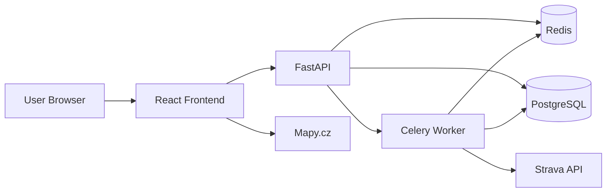
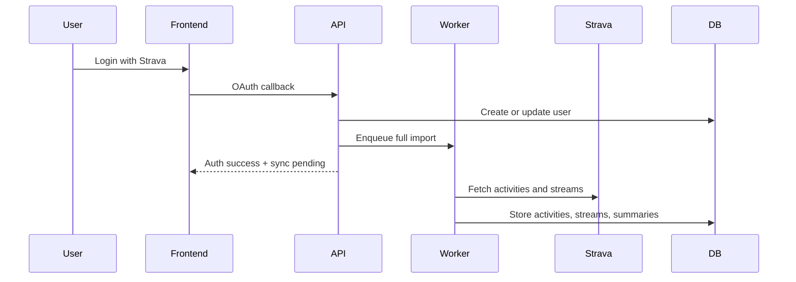
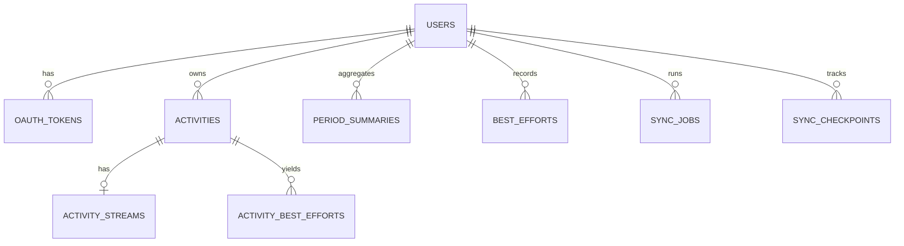

# Strava Insights Project Specification

## Summary

Strava Insights is a desktop web application for hobby athletes who want fast access to training analytics based on
their Strava data. The system imports Strava activities into a local database, computes derived metrics, and serves the
UI from local storage and cache instead of live Strava requests.

## Product Requirements

- Authentication uses Strava OAuth only.
- The system supports multiple users, each with separate data.
- Supported sports are running and cycling, including e-bike and related cycling ride types.
- First login triggers a full historical import in the background.
- Ongoing synchronization runs daily, with optional refresh on startup if data is stale.
- Users cannot export, delete, or disconnect their data in v1.
- Historical edits made later in Strava do not need to be synchronized.
- Desktop is the primary target; mobile is not required.

## Performance Requirements

- Normal UI reads should complete within 500 ms when served from local storage/cache.
- Standard page rendering must not depend on synchronous Strava API calls.
- Activity detail must be fully renderable from locally stored streams and derived data.

## Technology Stack

- Frontend: React, Tailwind CSS, Recharts, Mapy.cz
- Backend: Python 3.13, FastAPI
- Jobs: Celery
- Database: PostgreSQL
- Cache and broker: Redis
- Local workflow: simple `make`-style commands driving Docker-based build, run, and test tasks

## Architecture

- React frontend
- FastAPI backend API
- Celery worker for import and sync jobs
- PostgreSQL as the source of truth
- Redis for cache and job state
- Docker as the local virtualization and validation environment

## Functional Scope

Required screens:

- landing/login
- dashboard
- calendar
- activity list
- activity detail
- best efforts
- settings/profile
- sync/import status

Required analytics:

- progression over time
- pace or speed trends
- elevation trends
- training load or difficulty trend
- best efforts
- monthly, yearly, and rolling comparisons
- single-activity analysis

Filters required in v1:

- sport type
- date range

## Activity Detail Requirements

The activity detail page must preserve the current analytical scope and improve presentation.

Required elements:

- activity metadata and KPI summary
- route map using Mapy.cz and stored GPS points
- pace for running or speed for cycling
- heart rate where available
- elevation
- slope
- hover-linked marker on the map driven by the graph
- running interval and pace-zone analysis equivalent to the current app

The graph should use distance as the shared x-axis and show:

- pace or speed
- heart rate
- elevation
- slope

The backend detail payload must include:

- metadata and KPI values
- map bounds and polyline
- distance-aligned series for pace or speed, heart rate, elevation, and slope
- running interval-analysis output when applicable

## Sync Model

- First login enqueues a full historical import.
- Users can enter the app while import is running and see sync progress.
- Daily refresh imports only new activities.
- New data invalidates affected cache entries and recomputes summaries.

## Development Workflow

- Use Docker as the standard local virtualization environment.
- Build, run, and test the full stack through simple `make`-style commands.
- The command surface should stay short and predictable.
- Every code change must be followed by a successful build validation.

Expected commands:

- `make build` builds the Docker images
- `make up` starts frontend, backend, worker, database, and Redis
- `make test` runs the automated test suite inside Docker
- `make down` stops the local stack

Normal validation should happen through Docker, not by relying on partially manual host setup.

## Data Model

Core entities:

- `users`
- `oauth_tokens`
- `activities`
- `activity_streams`
- `period_summaries`
- `best_efforts`
- `activity_best_efforts`
- `sync_jobs`
- `sync_checkpoints`

Key indexes:

- `activities(user_id, start_date_utc desc)`
- `activities(user_id, sport_type, start_date_utc desc)`
- `period_summaries(user_id, sport_type, period_type, period_start)`
- `best_efforts(user_id, sport_type, effort_code)`

## API Requirements

The backend should expose:

- auth endpoints for Strava login and callback
- current-user profile endpoint
- sync-status endpoint
- dashboard endpoint
- comparison and trend endpoints
- activity list endpoint with sport and date filters
- activity detail endpoint
- best-efforts endpoint

The backend should also be designed so it can be extended later with user-scoped LLM and insight features without major architectural rework. This means:

- keep read APIs structured and reusable for machine-consumable access
- expose analytics through stable service boundaries instead of embedding logic only in controllers or frontend code
- keep derived metrics and summaries available in backend-readable form
- make it possible to add future insight-oriented endpoints over local user data

Future extensibility should support:

- natural-language querying over the user's own imported activity data
- explanation-style insights about what the user is doing well
- explanation-style insights about patterns that appear weak or inconsistent
- evidence-backed reasoning based on stored activity history, summaries, trends, and best efforts

The intended future direction is observational insights, not prescriptive coaching. The system should be prepared to answer questions such as:

- what have I improved recently
- what am I consistently doing well
- where am I underperforming compared with my own patterns
- which workouts or periods were less effective and why
- how my recent training compares with earlier periods or goals

## Delivery Notes

- Preserve the analytical intent of the current app, especially on the activity detail page.
- Redesign navigation and UI freely as long as the information set remains available.
- Use local data, precomputed summaries, and cache to keep reads fast.
