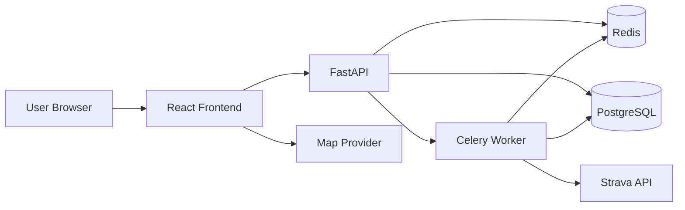
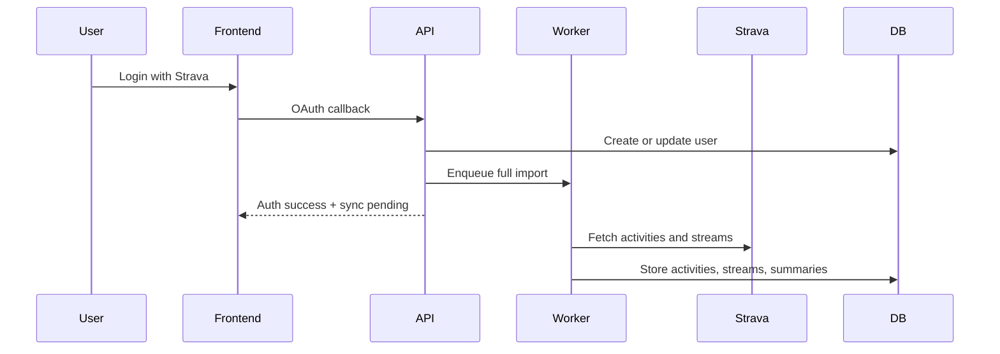

# Strava Insights Specification

## Purpose

Strava Insights is a desktop-first web application for athletes who want fast analytics over their Strava history without depending on live Strava reads during normal app use. The system imports Strava data into local storage, computes derived metrics, and serves dashboards and activity detail views from the local database and cache.

## Documentation Roles

- `docs/specification.md`: source of truth for product scope, architecture, constraints, and required behavior
- `docs/implementation_plan.md`: source of truth for implementation status and remaining work
- `docs/development.md`: source of truth for local setup, validation commands, and day-to-day development workflow

## Product Scope

### Core Requirements

- Authentication uses Strava OAuth only.
- The system supports multiple users with isolated data.
- Supported sports in v1 are running, cycling, and e-bike ride types.
- First login triggers a background full historical import.
- Ongoing synchronization runs daily, with optional refresh on startup when data is stale.
- Users cannot export, delete, or disconnect their data in v1.
- Historical edits and deletions performed later in Strava are out of scope for v1.
- Desktop is the primary target. Mobile optimization is not required for v1.

### Required Screens

- landing/login
- dashboard
- calendar
- activity list
- activity detail
- best efforts
- settings/profile
- sync/import status

## Performance and Operational Requirements

- Normal UI reads should complete within 500 ms when served from local storage or cache.
- Standard page rendering must not depend on synchronous Strava API calls.
- Activity detail must be renderable from locally stored activity and stream data.
- Duplicate activities must be upserted by Strava activity id.
- Token expiry during sync must trigger refresh and retry.
- Temporary Strava API failures should retry with backoff before a sync job is marked failed.
- Partial import failure for one activity must not corrupt already persisted valid data.

## Technology and Delivery Constraints

### Target Stack

- Frontend: React, Tailwind CSS, Recharts, Mapy.cz-backed map rendering
- Backend: Python 3.13, FastAPI, Poetry
- Worker: Celery, Poetry
- Database: PostgreSQL
- Cache and broker: Redis
- Local validation: Docker Compose driven through short `make` targets

### Local Workflow Requirements

- Docker is the standard local validation environment.
- The repository must expose short task entrypoints such as `make build`, `make up`, `make test`, and `make down`.
- Windows is the primary local environment, so command design must remain Windows-compatible.
- Every meaningful iteration should be validated locally.
- Every meaningful code change must include a successful build validation.
- Do not rely on deleting or recreating the database as a normal development step.
- When schema changes are required, add explicit backward-safe migrations.

## Architecture

### Target Structure

- `frontend`: React web application
- `backend`: FastAPI application for auth, read APIs, profile management, and sync orchestration
- `worker`: Celery worker for full import, incremental sync, and read-model refresh
- `postgres`: source of truth for persisted application data
- `redis`: cache plus Celery broker/backend

### Architectural Rules

- Keep framework code at the edges.
- Keep business logic in testable domain and application layers.
- Isolate infrastructure concerns such as Strava access, persistence, cache, and background jobs.
- Avoid coupling UI code, HTTP handlers, and persistence logic directly.
- Maintain clear separation between auth, sync, analytics, and read APIs.
- Keep read APIs reusable so future machine-consumable or insight-oriented endpoints can be added without major redesign.

## Frontend Direction

The frontend should feel closer to Strava web than to a generic admin dashboard.

### Visual Direction

- clean, bright, metric-first presentation
- light primary surfaces
- dark or charcoal text for primary numbers and labels
- orange accent for active controls, emphasis states, and cycling-related indicators
- restrained neutral grays for borders, dividers, and secondary text
- large KPI numbers with compact labels
- rounded cards and controls without over-soft consumer styling
- simple layouts with generous whitespace and minimal decoration

### Avoid

- dark default product surfaces
- neon gradients or glass-heavy styling
- decorative effects that compete with metrics
- arbitrary color systems unrelated to sport meaning

## Analytics and Read Requirements

### Global Analytics Scope

The application must support:

- progression over time
- pace or speed trends
- elevation trends
- training load or difficulty trends
- best efforts
- monthly, yearly, and rolling comparisons
- single-activity analysis

### Shared Filters

- sport type
- date range

### Dashboard Comparison Windows

- current week versus previous week
- current month versus previous month
- current year versus previous year
- rolling 30 days versus previous rolling 30 days

Supported comparison selectors:

- `week`
- `month`
- `year`
- `rolling_30d`

### Comparison Metrics

- total distance
- total moving time
- activity count
- average running pace for running activities
- average cycling speed for cycling activities

Rules:

- comparisons must honor the selected sport filter
- period pace and speed must be derived from aggregated totals, not from averaging per-activity averages
- running pace is `total_moving_time / total_distance`
- cycling speed is `total_distance / total_moving_time`

## Activity Data Requirements

### Imported Activity Fields

At minimum, imported activity metadata must support:

- `id`
- `name`
- `description`
- `start_date_local`
- `type`
- `distance`
- `moving_time`
- `elapsed_time`
- `total_elevation_gain`
- `elev_high`
- `elev_low`
- `average_speed`
- `max_speed`
- `average_heartrate`
- `max_heartrate`
- `average_cadence`
- `start_latlng`

### Imported Streams

When available, the system must persist streams needed for local detail rendering:

- `time`
- `distance`
- `latlng`
- `altitude`
- `velocity_smooth`
- `heartrate`

### Normalized Read Fields

Backend read models and API payloads should expose at least:

- `distance_km = distance / 1000`
- formatted moving time
- running pace when applicable
- cycling speed in `km/h`
- route polyline and map bounds when GPS data exists

## Activity Summary KPIs

Activity summary surfaces and detail headers must expose:

- distance in kilometers
- moving time
- running pace for running activities or speed for cycling activities
- total elevation gain
- average heart rate when available
- heart-rate drift in bpm when heart-rate and distance streams are available

Formatting rules:

- `distance_km = round(distance / 1000, 2)`
- moving time is `M:SS` below one hour and `H:M:SS` for longer durations
- running summary pace is displayed as `min/km`
- cycling speed is displayed in `km/h`
- elevation is displayed in meters
- heart rate is displayed in bpm

If heart-rate data is missing, the API must return a nullable value and the frontend must omit or soften that KPI without failing the page.

## Derived Difficulty Metric

The current application uses a local heuristic to rank effort. Preserve it as a reusable derived metric in v1.

Formula:

- `d_distance_km = distance_km / 15`
- `d_total_elevation_gain = total_elevation_gain / 150`
- `d_average_heartrate = average_heartrate / user.max_bpm`
- `d_average_speed = 6 - abs(user.speed_max - average_speed_kmh)`
- `difficulty = d_distance_km * d_total_elevation_gain * d_average_heartrate * d_average_speed`

Definitions:

- `average_speed_kmh = average_speed * 3.6`
- `user.max_bpm` comes from the user profile
- `user.speed_max` comes from the user profile

This metric is a product-specific heuristic, not a scientific training score.

## Best Efforts

### Functional Scope

Best efforts should be available for:

- running
- ride
- e-bike ride

The implementation should remain extensible to new effort distances and sport categories without schema rework.

### Record Requirements

Each best-effort record should retain at least:

- user id
- sport type
- effort code or canonical distance label
- best time
- source activity id
- source activity date

Implementation rule:

- prefer imported Strava best-effort or split-like data when available and trustworthy
- otherwise derive best efforts locally from persisted activity and stream data

## Activity Detail Requirements

### Required Elements

- activity metadata and KPI summary
- route map based on stored GPS points
- pace for running or speed for cycling
- heart rate when available
- elevation when available
- slope when available
- hover-linked active marker on the map driven by graph focus
- running interval and pace-zone analysis for running activities

The activity detail page must preserve the current analytical intent of the legacy application unless a later design decision explicitly replaces that behavior.

### Detail Payload Requirements

The backend detail payload must include:

- metadata and KPI values
- map bounds and route polyline when GPS is present
- distance-aligned series for pace or speed
- distance-aligned heart-rate series when present
- distance-aligned elevation series when present
- distance-aligned slope series when derivable
- running interval-analysis output when applicable

### Canonical Derived Series

For v1, these are the canonical activity-detail derivations:

- `distance_km` comes from stream distance values in meters
- moving-average heart rate uses a centered moving average with `range_points = 10`
- moving-average speed uses `velocity_smooth * 3.6` with `range_points = 10`
- running pace uses stream `time` and `distance` with a centered window of `range_points = 20`
- running pace values are capped at `16 min/km`
- running pace must be available both as numeric `min/km` and display-ready `MM:SS /km`
- slope uses altitude change over a 30-point window divided by horizontal distance and converted to percent
- slope values are clamped to `[-45, 45]`

Current pace derivation behavior to preserve:

- `start_index = max(0, i - range_points)`
- `end_index = min(len(stream) - 1, i + range_points)`
- `pace_min_per_km = delta_time_minutes / delta_distance_km`

If `delta_distance` is zero, pace should be treated as infinite and legacy-compatible formatted output should render `0:00`.

## Running Zones and Interval Analysis

### Zone Labels

- `100m`
- `5km`
- `10km`
- `Half-Marathon`
- `Marathon`
- `Active Jogging`
- `Slow Jogging`
- `Walk`

### Zone Anchors

- `bpm_max = 220 - 0.7 * age`
- `100m pace = 60 / (1.15 * speed_max)`, `100m bpm = 1.00 * bpm_max`
- `5km pace = 60 / (0.90 * speed_max)`, `5km bpm = 0.95 * bpm_max`
- `10km pace = 60 / (0.85 * speed_max)`, `10km bpm = 0.90 * bpm_max`
- `Half-Marathon pace = 60 / (0.80 * speed_max)`, `Half-Marathon bpm = 0.85 * bpm_max`
- `Marathon pace = 60 / (0.75 * speed_max)`, `Marathon bpm = 0.80 * bpm_max`
- `Active Jogging pace = 60 / (0.70 * speed_max)`, `Active Jogging bpm = 0.75 * bpm_max`
- `Slow Jogging pace = 60 / (0.50 * speed_max)`, `Slow Jogging bpm = 0.60 * bpm_max`
- `Walk pace = 60 / 4.8`, `Walk bpm = 0.40 * bpm_max`

### Zone Boundary Rules

- pace ranges use midpoints between adjacent pace anchors
- heart-rate ranges use midpoints between adjacent bpm anchors
- pace-zone matching uses `lower <= pace < upper`
- heart-rate-zone matching uses `lower <= bpm < upper`

### Interval Analysis Output

For running activities, interval segmentation should group consecutive data points while both remain unchanged:

- detected pace zone
- detected heart-rate zone

Each interval contains:

- `distance_km[]`
- `pace[]`
- `heart_rate[]`
- `zones.zone_pace`
- `zones.zone_heart_rate`

Per-zone summaries must include:

- average pace within the zone
- average heart rate within the zone
- total distance accumulated within the zone

### Running Analysis Summary

The backend should preserve a simple textual or structured analysis output derived from dominant pace zones:

- select up to two dominant pace zones whose accumulated distance passes the threshold for that zone
- thresholds are `0.5 km` for `100m` and `5km`, `1.0 km` for `10km`, `2.1 km` for `Half-Marathon`, `4.2 km` for `Marathon`, and `0 km` for jogging and walking zones
- prioritize race-oriented zones before jogging and walking zones
- compute a compliance score for the dominant zone as the percentage of zone distance whose heart-rate zone is at or below the associated pace-zone target

This is explanatory feedback, not prescriptive coaching.

## Missing Data Behavior

- The activity detail page must still load when core activity metadata exists.
- Missing heart-rate data must hide heart-rate KPIs and related graph content without failing the page.
- Missing GPS data must hide the route map and hover-linked marker behavior.
- Missing altitude data must hide elevation and slope visualizations.
- Slope must only be computed when both altitude and distance streams are available.
- If an activity is only partially imported, valid local data must remain readable.

The UI should omit unavailable widgets rather than showing placeholder errors.

## Calendar Requirements

### Monthly View Behavior

- render one visible cell per day
- aggregate all activities in a day into one daily summary marker
- use the sum of same-day activities as the daily total
- allow drilling into the activities for the selected day

### Daily Marker Rules

- use one circular marker as the primary daily encoding
- marker diameter scales with total daily distance in kilometers
- days with greater total distance must render larger circles
- days with no activities should have no marker or a minimal empty state

### Daily Color Rules

- running days use yellow
- cycling days use orange
- mixed-sport days use the color of the sport contributing the greater distance share

The calendar should feel closer to a Strava-style training overview than to a traditional enterprise calendar widget.

## Sync Model

- First login enqueues a full historical import.
- Users can use the app while import is running and see sync progress.
- Daily refresh imports only newly available activities.
- Manual refresh is incremental only and must not trigger a full reimport.
- New data invalidates affected cache entries and recomputes summaries as needed.
- Deletions and later historical edits in Strava remain out of scope for v1.
- If a sync checkpoint is missing, incremental sync should fall back to the latest locally stored activity timestamp rather than reimporting full history.
- If Strava activity streams return `404`, import the activity and continue without streams.

## Data Model

### Core Entities

- `users`
- `user_profiles`
- `oauth_tokens`
- `activities`
- `activity_streams`
- `period_summaries`
- `best_efforts`
- `activity_best_efforts`
- `sync_jobs`
- `sync_checkpoints`

### Persistence Expectations

The schema must support:

- imported activity metadata
- imported streams needed for local rendering
- activity-level derived KPI inputs and normalized fields
- derived detail series when precomputation is beneficial
- interval-analysis outputs when precomputation is beneficial
- Strava athlete identity and analytics profile inputs such as age or birthday, `speed_max`, and optional future overrides

### Key Indexes

- `activities(user_id, start_date_utc desc)`
- `activities(user_id, sport_type, start_date_utc desc)`
- `period_summaries(user_id, sport_type, period_type, period_start)`
- `best_efforts(user_id, sport_type, effort_code)`

## API Requirements

The backend must expose:

- auth endpoints for Strava login and callback
- current-user profile endpoint
- sync-status endpoint
- dashboard endpoint
- comparison and trend endpoints
- activity list endpoint with sport and date filters
- activity detail endpoint
- best-efforts endpoint

The backend should remain extensible for future user-scoped insight features by keeping analytics and read models accessible through stable backend service boundaries.
