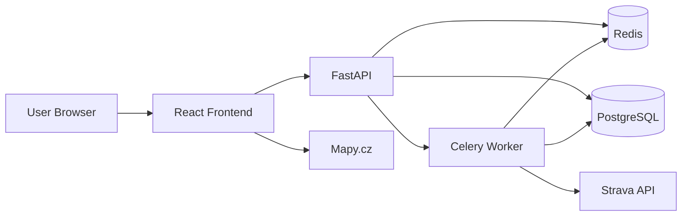
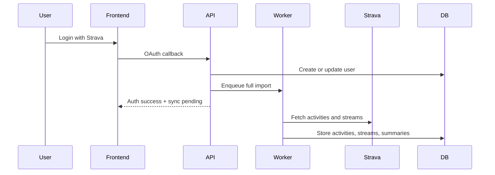
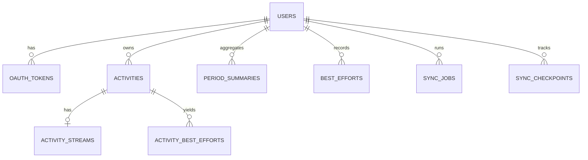

# Strava Insights Project Specification

## Summary

Strava Insights is a desktop web application for hobby athletes who want fast access to training analytics based on
their Strava data. The system imports Strava activities into a local database, computes derived metrics, and serves the
UI from local storage and cache instead of live Strava requests.

## Product Requirements

- Authentication uses Strava OAuth only.
- The system supports multiple users, each with separate data.
- Supported sports are running and cycling, including e-bike and related cycling ride types.
- First login triggers a full historical import in the background.
- Ongoing synchronization runs daily, with optional refresh on startup if data is stale.
- Users cannot export, delete, or disconnect their data in v1.
- Historical edits made later in Strava do not need to be synchronized.
- Desktop is the primary target; mobile is not required.

## Performance Requirements

- Normal UI reads should complete within 500 ms when served from local storage/cache.
- Standard page rendering must not depend on synchronous Strava API calls.
- Activity detail must be fully renderable from locally stored streams and derived data.

## Technology Stack

- Frontend: React, Tailwind CSS, Recharts, Mapy.cz
- Backend: Python 3.13, FastAPI, Poetry
- Jobs: Celery
- Database: PostgreSQL
- Cache and broker: Redis
- Local workflow: simple `make`-style commands driving Docker-based build, run, and test tasks

## Architecture

- React frontend
- FastAPI backend API
- Celery worker for import and sync jobs
- PostgreSQL as the source of truth
- Redis for cache and job state
- Docker as the local virtualization and validation environment

## Functional Scope

Required screens:

- landing/login
- dashboard
- calendar
- activity list
- activity detail
- best efforts
- settings/profile
- sync/import status

Required analytics:

- progression over time
- pace or speed trends
- elevation trends
- training load or difficulty trend
- best efforts
- monthly, yearly, and rolling comparisons
- single-activity analysis

Filters required in v1:

- sport type
- date range

### Dashboard and Comparison Metrics

The dashboard and comparison views in v1 should focus on simple period-over-period comparisons over imported local data.

Required comparison windows:

- current month versus previous month
- current year versus previous year

Required comparison metrics:

- total distance
- total moving time
- activity count
- average running pace for running activities
- average cycling speed for cycling activities

Comparison metrics must be computed separately per sport type when a sport filter is applied.

For period-level pace and speed comparisons:

- do not compute a naive average of per-activity averages
- instead derive the period metric from aggregated totals
- running pace should be computed from `total_moving_time / total_distance`
- cycling speed should be computed from `total_distance / total_moving_time`

This is a requirement for correctness because direct averaging of per-activity values would bias the result toward shorter sessions.

## Activity Metrics and KPI Definitions

The system should distinguish clearly between three categories of activity data:

- raw activity fields imported from Strava
- derived per-activity KPI values shown in summary cards and lists
- derived time-series and analytical outputs used by the activity detail page

Supported imported activity fields for v1 should include at least:

- `id`
- `name`
- `description`
- `start_date_local`
- `type`
- `distance`
- `moving_time`
- `elapsed_time`
- `total_elevation_gain`
- `elev_high`
- `elev_low`
- `average_speed`
- `max_speed`
- `average_heartrate`
- `max_heartrate`
- `average_cadence`
- `start_latlng`

The current application also uses the following activity streams for detail analysis and must preserve them in v1 when available:

- `time`
- `distance`
- `latlng`
- `altitude`
- `velocity_smooth`
- `heartrate`

For persisted read models and API payloads, the backend should normalize and expose at least:

- `distance_km = distance / 1000`
- formatted moving time for display
- running pace derived from time and distance where applicable
- cycling speed in `km/h`
- route polyline and map bounds

### Activity Summary KPI Cards

The activity detail header and activity-summary surfaces should expose the following KPI set:

- distance in kilometers
- moving time
- average pace for running or max speed for cycling
- total elevation gain
- average heart rate when available

The current application renders these values as follows:

- `distance_km = round(distance / 1000, 2)`
- moving time is formatted as `M:SS` for durations below one hour and `H:M:SS` for longer durations
- running summary pace is computed from `average_speed` and displayed as `min/km`
- cycling summary speed is displayed in `km/h`
- elevation is displayed in meters
- heart rate is displayed in beats per minute

If heart-rate data is absent, the API must return a nullable value and the frontend must render the KPI gracefully without failing the page.

### Derived Activity Difficulty KPI

The current application computes a coarse per-activity difficulty score for activity lists and calendar summaries. This should be preserved as a derived metric in v1, even if the UI wording later changes.

Current formula:

- `d_distance_km = distance_km / 15`
- `d_total_elevation_gain = total_elevation_gain / 150`
- `d_average_heartrate = average_heartrate / user.max_bpm`
- `d_average_speed = 6 - abs(user.speed_max - average_speed_kmh)`
- `difficulty = d_distance_km * d_total_elevation_gain * d_average_heartrate * d_average_speed`

Where:

- `average_speed_kmh = average_speed * 3.6`
- `user.max_bpm` is taken from the user profile
- `user.speed_max` is taken from the user profile

This difficulty score is not a training-science metric. It is a local heuristic used to rank or visually mark sessions by effort level. The new architecture should keep it isolated as a reusable analytics function so it can be revised later without changing raw imports.

### Best Efforts

Best efforts in v1 should be intentionally narrow and easy to understand.

Scope for v1:

- running only
- best time for `1 km`
- best time for `5 km`
- best time for `10 km`
- best time for `Half-Marathon`

Each best-effort record should retain at least:

- user id
- effort code or canonical distance label
- best time
- source activity id
- source activity date

Implementation rule:

- use imported Strava best-effort or split-style data when it is available and reliable
- otherwise derive the best effort locally from stored activity and stream data

The backend should expose the best mark per user and distance for the selected sport and should be designed so additional distances can be added later without schema rework.

## Activity Detail Requirements

The activity detail page must preserve the current analytical scope and improve presentation.

Required elements:

- activity metadata and KPI summary
- route map using Mapy.cz and stored GPS points
- pace for running or speed for cycling
- heart rate where available
- elevation
- slope
- hover-linked marker on the map driven by the graph
- running interval and pace-zone analysis equivalent to the current app

The activity detail page should preserve the current behavior and formulas from the existing application unless a later design decision explicitly replaces them.

The graph should use distance as the shared x-axis and show:

- pace or speed
- heart rate
- elevation
- slope

The backend detail payload must include:

- metadata and KPI values
- map bounds and polyline
- distance-aligned series for pace or speed, heart rate, elevation, and slope
- running interval-analysis output when applicable

### Detail-Series Definitions

For v1, the following derived series should be treated as the canonical activity-detail behavior:

- `distance_km` is derived from stream distance values in meters
- moving-average heart rate uses a centered moving average with `range_points = 10`
- moving-average speed uses `velocity_smooth * 3.6` and a centered moving average with `range_points = 10`
- running pace is derived from stream `time` and `distance` using a centered window with `range_points = 20`
- derived running pace values are capped at `16 min/km` to avoid unstable values at very low movement
- pace should be available in both numeric `min/km` form and display-ready `MM:SS /km` form
- slope uses altitude change over a 30-point window divided by horizontal distance and converted to percent
- slope values are clamped to the range `[-45, 45]`

The current pace derivation uses a symmetric local window:

- `start_index = max(0, i - range_points)`
- `end_index = min(len(stream) - 1, i + range_points)`
- `pace_min_per_km = (delta_time_minutes / delta_distance_km)`

If `delta_distance` is zero, the derived pace should be treated as infinite and displayed as `0:00` in legacy-compatible formatted output.

### Running Pace and Heart-Rate Zones

For running activities, v1 must preserve the current user-relative pace and heart-rate zone model because the interval analysis and detail graph depend on it.

Current zone labels:

- `100m`
- `5km`
- `10km`
- `Half-Marathon`
- `Marathon`
- `Active Jogging`
- `Slow Jogging`
- `Walk`

Current zone anchor formulas are:

- `bpm_max = 220 - 0.7 * age`
- `100m pace = 60 / (1.15 * speed_max)`, `100m bpm = 1.00 * bpm_max`
- `5km pace = 60 / (0.90 * speed_max)`, `5km bpm = 0.95 * bpm_max`
- `10km pace = 60 / (0.85 * speed_max)`, `10km bpm = 0.90 * bpm_max`
- `Half-Marathon pace = 60 / (0.80 * speed_max)`, `Half-Marathon bpm = 0.85 * bpm_max`
- `Marathon pace = 60 / (0.75 * speed_max)`, `Marathon bpm = 0.80 * bpm_max`
- `Active Jogging pace = 60 / (0.70 * speed_max)`, `Active Jogging bpm = 0.75 * bpm_max`
- `Slow Jogging pace = 60 / (0.50 * speed_max)`, `Slow Jogging bpm = 0.60 * bpm_max`
- `Walk pace = 60 / 4.8`, `Walk bpm = 0.40 * bpm_max`

Zone boundaries are derived from the midpoints between adjacent zone anchors:

- pace ranges use half-way points between neighboring target pace values
- heart-rate ranges use half-way points between neighboring target bpm values
- pace zone matching uses `lower <= pace < upper`
- heart-rate zone matching uses `lower <= bpm < upper`

### Running Interval Analysis Output

For running activities, the backend should expose interval-analysis output derived from the distance-aligned pace and heart-rate series.

The current implementation groups consecutive data points into intervals whenever both of these remain unchanged:

- detected pace zone
- detected heart-rate zone

Each interval contains:

- `distance_km[]`
- `pace[]`
- `heart_rate[]`
- `zones.zone_pace`
- `zones.zone_heart_rate`

The backend should also expose per-zone summary KPIs computed from the grouped intervals:

- average pace within the zone
- average heart rate within the zone
- total distance accumulated within the zone

The current app also derives a simple textual running analysis:

- select up to two dominant pace zones whose accumulated distance passes a minimum threshold
- thresholds are `0.5 km` for `100m` and `5km`, `1.0 km` for `10km`, `2.1 km` for `Half-Marathon`, `4.2 km` for `Marathon`, and `0 km` for jogging and walking zones
- prioritize race-oriented zones before jogging and walking zones
- compute a compliance score for the dominant zone as the percentage of zone distance whose heart-rate zone is at or below the associated pace-zone target

This score is currently used as explanatory activity feedback, not as a scientific training prescription. The new backend should preserve it as explicit derived output so the frontend and future insight features can reuse it.

### Missing Data Behavior

The activity detail page must degrade gracefully when some imported streams are missing.

V1 rules:

- the activity detail page should still load when core activity metadata exists
- missing heart-rate data must hide heart-rate KPIs and heart-rate graph content without failing the page
- missing GPS data must hide the route map and hover-linked marker behavior
- missing altitude data must hide elevation and slope visualizations
- slope must only be computed when both altitude and distance stream data are available
- if an activity is only partially imported, existing valid local data must remain readable

The UI should prefer omission of unavailable widgets over placeholder errors.

## Sync Model

- First login enqueues a full historical import.
- Users can enter the app while import is running and see sync progress.
- Daily refresh imports only new activities.
- New data invalidates affected cache entries and recomputes summaries.
- Duplicate activities must be upserted by Strava activity id rather than duplicated locally.
- Token expiry during sync should trigger token refresh and retry.
- Temporary Strava API failures should retry with backoff before the sync job is marked failed.
- Partial import failure for one activity must not corrupt already persisted valid activity data.
- Deletions and later historical edits in Strava remain out of scope for v1 and do not need to be reconciled locally.

## Development Workflow

- Use Docker as the standard local virtualization environment.
- Build, run, and test the full stack through simple `make`-style commands.
- The command surface should stay short and predictable.
- Every code change must be followed by a successful build validation.
- Use Poetry as the Python dependency and virtual-environment manager for backend and worker services.

Expected commands:

- `make build` builds the Docker images
- `make up` starts frontend, backend, worker, database, and Redis
- `make test` runs the automated test suite inside Docker
- `make down` stops the local stack

Normal validation should happen through Docker, not by relying on partially manual host setup.

When host-level Python commands are documented for backend or worker work, they should use Poetry rather than direct `pip` or ad hoc virtualenv commands.

## Data Model

Core entities:

- `users`
- `oauth_tokens`
- `activities`
- `activity_streams`
- `period_summaries`
- `best_efforts`
- `activity_best_efforts`
- `sync_jobs`
- `sync_checkpoints`
- `user_profiles`

Activity-related persistence should support both raw imported data and locally derived analytics. At minimum, the new schema should be able to store:

- imported activity metadata
- imported activity streams required for local rendering
- activity-level derived KPI values such as normalized distance and difficulty inputs
- derived activity-detail series when precomputation is beneficial
- running interval-analysis results when precomputation is beneficial

User-related persistence should support the analytics model and future overrides. At minimum, the system should be able to store:

- Strava athlete identity
- birthday or age input needed for age-based calculations
- `speed_max`
- optional future override fields such as user-defined max heart rate

Key indexes:

- `activities(user_id, start_date_utc desc)`
- `activities(user_id, sport_type, start_date_utc desc)`
- `period_summaries(user_id, sport_type, period_type, period_start)`
- `best_efforts(user_id, sport_type, effort_code)`

## API Requirements

The backend should expose:

- auth endpoints for Strava login and callback
- current-user profile endpoint
- sync-status endpoint
- dashboard endpoint
- comparison and trend endpoints
- activity list endpoint with sport and date filters
- activity detail endpoint
- best-efforts endpoint

The backend should also be designed so it can be extended later with user-scoped LLM and insight features without major architectural rework. This means:

- keep read APIs structured and reusable for machine-consumable access
- expose analytics through stable service boundaries instead of embedding logic only in controllers or frontend code
- keep derived metrics and summaries available in backend-readable form
- make it possible to add future insight-oriented endpoints over local user data

Future extensibility should support:

- natural-language querying over the user's own imported activity data
- explanation-style insights about what the user is doing well
- explanation-style insights about patterns that appear weak or inconsistent
- evidence-backed reasoning based on stored activity history, summaries, trends, and best efforts

The intended future direction is observational insights, not prescriptive coaching. The system should be prepared to answer questions such as:

- what have I improved recently
- what am I consistently doing well
- where am I underperforming compared with my own patterns
- which workouts or periods were less effective and why
- how my recent training compares with earlier periods or goals

## Delivery Notes

- Preserve the analytical intent of the current app, especially on the activity detail page.
- Redesign navigation and UI freely as long as the information set remains available.
- Use local data, precomputed summaries, and cache to keep reads fast.
