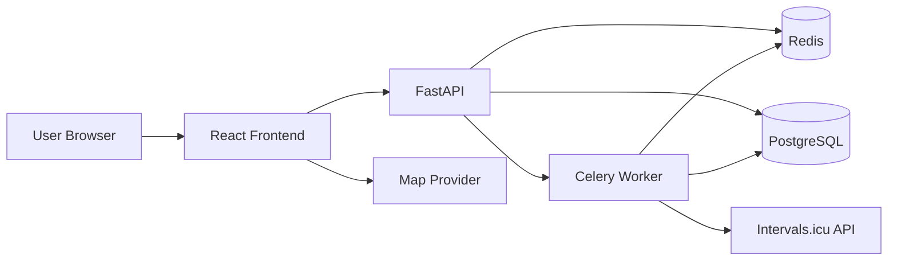
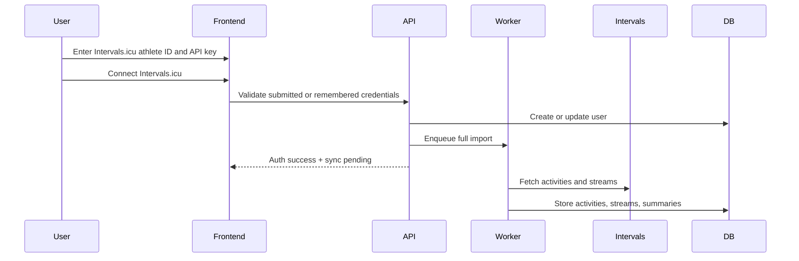

# Intervals Insights Specification

## Purpose

Intervals Insights is a desktop-first web application for athletes who want fast analytics over their Garmin-backed activity history without depending on live external-source reads during normal app use. The system imports Intervals.icu data into local storage, computes derived metrics, and serves dashboards and activity detail views from the local database and cache.

## Documentation Roles

- `docs/specification.md`: source of truth for product scope, architecture, constraints, and required behavior
- `docs/implementation_plan.md`: source of truth for implementation status and remaining work
- `docs/development.md`: source of truth for local setup, validation commands, and day-to-day development workflow

## Product Scope

### Core Requirements

- Authentication uses Intervals.icu athlete ID plus personal API key in the first Intervals.icu integration iteration.
- Before a user can connect, the landing/login screen must collect that user's Intervals.icu athlete ID and API key.
- The system supports multiple users with isolated data.
- Supported sports in v1 are running, cycling, and e-bike ride types; strength-training activities are omitted.
- First login triggers a background full historical import.
- Ongoing synchronization runs daily, with optional refresh on startup when data is stale.
- Users cannot export, delete, or disconnect their data in v1.
- A single admin athlete with source athlete id `632291` by default can review user access and disable other users.
- Historical edits and deletions performed later in Intervals.icu are out of scope for v1.
- Imported streams are sanitized before persistence so impossible speed, distance, GPS, altitude, and heart-rate samples do not contaminate reads or analytics.
- Activities sharing an Intervals.icu route id and sport can be compared from local data.
- Desktop is the primary target. Mobile optimization is not required for v1.

### Required Screens

- landing/login
- dashboard
- calendar
- activity list
- activity detail
- best efforts
- settings/profile
- admin users/audit
- sync/import status

## Performance and Operational Requirements

- Normal UI reads should complete within 500 ms when served from local storage or cache.
- Standard page rendering must not depend on synchronous Intervals.icu API calls.
- Activity detail must be renderable from locally stored activity and stream data.
- Duplicate activities must be upserted by source activity id. Intervals.icu `i123` activity ids are stored as numeric `123` in the existing activity id column for the no-schema-change migration.
- A manual sync always refreshes analytics. A scheduled sync with no imported or analytically stale data skips the read-model rebuild.
- Token expiry during sync must reuse and persist the refreshed Garmin session. A final Garmin authentication rejection
  must mark the connection as requiring reauthentication, stop scheduled syncs, and preserve imported data until the
  user reconnects and manually starts a sync.
- Temporary Intervals.icu API failures should retry with backoff before a sync job is marked failed.
- Partial import failure for one activity must not corrupt already persisted valid data.

## Technology and Delivery Constraints

### Target Stack

- Frontend: React, Tailwind CSS, Recharts, Mapy.cz-backed map rendering
- Backend: Python 3.13, FastAPI, Poetry
- Worker: Celery, Poetry
- Logging: Docker console output for backend and worker services
- Database: PostgreSQL
- Cache and broker: Redis
- Local validation: Docker Compose driven through short `make` targets

### Local Workflow Requirements

- Docker is the standard local validation environment.
- The repository must expose short task entrypoints such as `make build`, `make up`, `make test`, and `make down`.
- Windows is the primary local environment, so command design must remain Windows-compatible.
- Every meaningful iteration should be validated locally.
- Every meaningful code change must include a successful build validation.
- Do not rely on deleting or recreating the database as a normal development step.
- When schema changes are required, add explicit backward-safe migrations.

## Administration

- The admin identity is fixed to the configured athlete whose stored source athlete id is `632291` by default.
- The admin screen must show all users with basic audit fields: display name, source athlete id, active status, created/updated timestamps, and last login timestamp.
- The admin can disable any non-admin user.
- A disabled user must be blocked from further app use and from reconnecting through Intervals.icu credentials.
- The admin account cannot disable itself.

## Architecture

### Target Structure

- `frontend`: React web application
- `backend`: FastAPI application for auth, read APIs, profile management, and sync orchestration
- `worker`: Celery worker for full import, incremental sync, and read-model refresh
- `beat`: Celery beat scheduler for daily sync orchestration
- `postgres`: source of truth for persisted application data
- `redis`: cache plus Celery broker/backend

### Architectural Rules

- Keep framework code at the edges.
- Keep business logic in testable domain and application layers.
- Isolate infrastructure concerns such as Intervals.icu access, persistence, cache, and background jobs.
- Avoid coupling UI code, HTTP handlers, and persistence logic directly.
- Maintain clear separation between auth, sync, analytics, and read APIs.
- Keep read APIs reusable so future machine-consumable or insight-oriented endpoints can be added without major redesign.
- Emit readable service logs to container stdout.

```mermaid
flowchart LR
    U[User Browser] --> FE[React Frontend]
    FE --> API[FastAPI]
    FE --> MAPY[Map Provider]
    API --> R[(Redis)]
    API --> DB[(PostgreSQL)]
    API --> W[Celery Worker]
    W --> INTERVALS[Intervals.icu API]
    W --> DB
    W --> R
```

## Frontend Direction

The frontend should feel closer to a modern athlete training platform than to a generic admin dashboard.

### Visual Direction

- clean, bright, metric-first presentation
- light primary surfaces
- dark or charcoal text for primary numbers and labels
- orange accent for active controls, emphasis states, and cycling-related indicators
- restrained neutral grays for borders, dividers, and secondary text
- large KPI numbers with compact labels
- rounded cards and controls without over-soft consumer styling
- simple layouts with generous whitespace and minimal decoration

### Avoid

- dark default product surfaces
- neon gradients or glass-heavy styling
- decorative effects that compete with metrics
- arbitrary color systems unrelated to sport meaning

## Analytics and Read Requirements

### Global Analytics Scope

The application must support:

- progression over time
- pace or speed trends
- elevation trends
- training-load-oriented trends
- best efforts
- monthly, yearly, and rolling comparisons
- single-activity analysis

### Shared Filters

- sport type
- date range

### Dashboard Comparison Windows

- current week versus previous week
- current month versus previous month
- current year versus previous year
- rolling 30 days versus previous rolling 30 days

Supported comparison selectors:

- `week`
- `month`
- `year`
- `rolling_30d`

### Comparison Metrics

- total distance
- total moving time
- activity count
- average running pace for running activities
- average cycling speed for cycling activities

Rules:

- comparisons must honor the selected sport filter
- period pace and speed must be derived from aggregated totals, not from averaging per-activity averages
- running pace is `total_moving_time / total_distance`
- cycling speed is `total_distance / total_moving_time`

## Activity Data Requirements

### Imported Activity Fields

At minimum, imported activity metadata must support:

- `id`
- `name`
- `description`
- `start_date_local`
- `type`
- `distance`
- `moving_time`
- use Garmin's moving pace/speed fields when provided; otherwise derive average pace or speed from moving time,
  excluding pauses represented by elapsed time
- `elapsed_time`
- `total_elevation_gain`
- `average_speed`
- `max_speed`
- `average_heartrate`
- `average_cadence`

### Imported Streams

When available, the system must persist streams needed for local detail rendering:

- `time`
- `distance`
- `latlng`
- `altitude`
- `velocity_smooth`
- `heartrate`

Garmin positional activity-detail metrics must be normalized from their descriptor keys (including `sumDuration`,
`sumDistance`, `directLatitude`, `directLongitude`,
`directElevation`, `directHeartRate`, and `directSpeed`) before persistence.

Imported and previously stored streams must be sanitized without changing sample-array alignment:

- invalid samples become null rather than being removed
- distance remains non-negative and monotonic, with impossible increments corrected
- negative or sport-impossible speed is removed
- invalid coordinates and impossible GPS jumps are removed
- impossible altitude and heart-rate jumps are removed
- GPS null runs split route rendering into separate map segments

### Normalized Read Fields

Backend read models and API payloads should expose at least:

- `distance_km = distance / 1000`
- formatted moving time
- running pace when applicable
- cycling speed in `km/h`
- route polyline and map bounds when GPS data exists

## Activity Summary KPIs

Activity summary surfaces and detail headers must expose:

- distance in kilometers
- moving time
- running pace for running activities or speed for cycling activities
- total elevation gain
- average heart rate when available

Formatting rules:

- `distance_km = round(distance / 1000, 2)`
- moving time is `M:SS` below one hour and `H:M:SS` for longer durations
- running summary pace is displayed as `min/km`
- cycling speed is displayed in `km/h`
- elevation is displayed in meters
- heart rate is displayed in bpm

If heart-rate data is missing, the API must return a nullable value and the frontend must omit or soften that KPI without failing the page.

## Best Efforts

### Functional Scope

Best efforts should be available for:

- running
- ride
- e-bike ride

The implementation should remain extensible to new effort distances and sport categories without schema rework.

### Record Requirements

Each best-effort record should retain at least:

- user id
- sport type
- effort code or canonical distance label
- best time
- source activity id
- source activity date

For every configured sport and distance, the read model retains the five fastest efforts ordered by time. Rank is derived from that ordering rather than stored separately.

Implementation rule:

- prefer imported source best-effort or split-like data when available and trustworthy
- otherwise derive best efforts locally from persisted activity and stream data
- import running effort curves from Intervals.icu in one bulk request during analytics refresh
- derive cycling efforts with a linear sliding-window algorithm over sanitized local streams
- show rank 1 by default on the Best Efforts screen and allow expanding ranks 2 through 5
- link every effort to its originating local activity
- show all top-five efforts owned by an activity in Activity Detail

## Activity Detail Requirements

### Required Elements

- activity metadata and KPI summary
- route map based on stored GPS points
- pace for running or speed for cycling
- heart rate when available
- elevation when available
- slope when available
- hover-linked active marker on the map driven by graph focus
- average lines plus AeT and AnT guides on pace and heart-rate charts when thresholds are available
- cycling analysis for ride and e-bike ride activities using available speed, heart-rate, cadence, and terrain data
- top-five best-effort ranks owned by the activity
- a same-route comparison when at least two local activities of the same sport match by sanitized GPS geometry
- threshold-based running analysis for running activities when user thresholds are configured

The activity detail page may replace legacy running-analysis behavior when a clearer product-specific model is chosen.

### Detail Payload Requirements

The backend detail payload must include:

- metadata and KPI values
- map bounds and route polyline when GPS is present
- distance-aligned series for pace or speed
- distance-aligned heart-rate series when present
- distance-aligned elevation series when present
- distance-aligned slope series when derivable
- configured AeT and AnT threshold values when available for the user and activity
- cycling-analysis output when applicable
- running threshold-analysis output when applicable
- ranked best efforts owned by the activity
- local route-comparison attempts, rank, personal best, and difference when available

Route comparison behavior:

- derive route identity locally from persisted sanitized GPS streams; do not call a premium source route API
- compare only activities with the exact same sport type
- preserve route order and direction, so a reversed route is a different route
- treat same-direction closed loops as the same route when the recording starts at a different point on the loop
- tolerate normal GPS jitter and short missing runs while keeping genuine shortcuts and detours separate
- require at least 20 valid coordinate pairs, at least 80% valid GPS samples, at least 500 meters of route distance, and no unbridgeable GPS gap over 200 meters
- resample routes at 50-meter spacing with at most 500 signature points
- prefilter candidates by H3 resolution 9 cells and a maximum 5% activity-distance difference
- require bidirectional 95% route coverage within 75 meters, a maximum 150-meter Hausdorff distance, and a maximum 125-meter ordered Frechet distance
- require open-route start and finish points to remain within 150 meters; closed loops are start-position invariant but direction-sensitive
- build deterministic complete-link groups so an activity must match every existing member before groups merge
- rank by moving time
- display the fastest five attempts plus the current activity initially
- allow expanding the complete local attempt history
- include date, moving time, pace or speed, average heart rate, distance, and an activity link
- show a moving-time trend over the locally stored attempts
- render activity-owned best efforts in the top KPI grid as one icon-led tile spanning the four columns remaining after Avg HR and Efficiency
- show every best effort owned by the activity inside that tile, ordered by distance, with rank, distance, time, and pace or speed
- present efforts in one horizontal row on desktop, with PB in orange, rank two in silver, rank three in bronze, and ranks four and five in the neutral text color
- render the ranked route-attempt table and trend in a separate `Matching Routes` card after the slope chart, styled like the other detail cards
- keep the route map limited to the current activity rather than overlaying matched attempts
- avoid a separate route title or summary panel because the ranked table already identifies the current attempt and personal best
- omit route comparison when GPS is ineligible or fewer than two local activities belong to the route group

### Canonical Derived Series

For v1, these are the canonical activity-detail derivations:

- `distance_km` comes from stream distance values in meters
- moving-average heart rate uses a centered moving average with `range_points = 10`
- moving-average speed uses `velocity_smooth * 3.6` with `range_points = 10`
- running pace uses stream `time` and `distance` with a centered window of `range_points = 20`
- running pace values are capped at `16 min/km`
- running pace must be available both as numeric `min/km` and display-ready `MM:SS /km`
- slope uses altitude change over a 30-point window divided by horizontal distance and converted to percent
- slope values are clamped to `[-45, 45]`

Current pace derivation behavior to preserve:

- `start_index = max(0, i - range_points)`
- `end_index = min(len(stream) - 1, i + range_points)`
- `pace_min_per_km = delta_time_minutes / delta_distance_km`

If `delta_distance` is zero, pace should be treated as infinite and legacy-compatible formatted output should render `0:00`.

## Running Threshold Analysis

### Profile Inputs

Running threshold analysis should use explicit user-configured threshold snapshots when available.

Threshold snapshots must:

- store the full AeT/AnT HR and pace set together
- include an `effective_from` date
- be resolved for activity detail by the activity local calendar date, choosing the latest snapshot whose `effective_from` is on or before that date

Each snapshot includes:

- `aet_heart_rate_bpm`
- `ant_heart_rate_bpm`
- `aet_pace_min_per_km`
- `ant_pace_min_per_km`

### Band Rules

For pace and heart rate independently, classify each aligned running detail point into:

- `below_aet`
- `between_aet_ant`
- `above_ant`

Rules:

- `below_aet` means value is below the configured aerobic threshold
- `between_aet_ant` means value is at or above `AeT` and below `AnT`
- `above_ant` means value is at or above `AnT`

### Running Analysis Output

For running activities with complete threshold inputs and heart-rate plus pace series, the backend should return a structured threshold-analysis payload that includes:

- pace distribution across the three bands
- heart-rate distribution across the three bands
- pace-vs-heart-rate agreement share
- mismatch shares where pace intensity is higher than heart-rate intensity and vice versa

This is descriptive analysis, not prescriptive coaching.
Pace intensity above heart-rate intensity for more than half of the run can be treated as a positive condition or freshness signal when route, weather, intent, and heart-rate data quality are comparable. Heart-rate intensity above pace intensity for more than half of the run should be treated as a strain warning rather than an improvement signal. Interval-like sessions must be evaluated with the expectation that tempo and heart rate change repeatedly and that heart rate can lag behind pace changes.

The running-analysis UI should:

- show compact question-mark help affordances beside each metric label
- use those tooltips to explain what each metric means and how to read it
- show a green improving-condition icon beside `Pace Above HR` when its share is above 50%
- show a red decreasing-condition warning icon beside `HR Above Pace` when its share is above 50%

## Cycling Analysis

For ride and e-bike ride activities, the backend should return a structured cycling-analysis payload when speed data is available.

The first cycling-analysis version should use only currently stored data:

- ride speed distribution using session-relative speed bands
- heart-rate distribution across `below_aet`, `between_aet_ant`, and `above_ant` when HR thresholds and HR data are available
- climbing, flat, and descending distance share from slope-derived terrain classification
- average cadence when available on the activity

Cycling speed should not be treated as a physiological threshold proxy in the way running pace is.

## Missing Data Behavior

- The activity detail page must still load when core activity metadata exists.
- Missing heart-rate data must hide heart-rate KPIs and related graph content without failing the page.
- Missing GPS data must hide the route map and hover-linked marker behavior.
- Missing or ineligible GPS route signatures must hide route comparison without affecting activity detail.
- Incomplete GPS coordinate streams, including scalar-only or null-containing Intervals.icu stream data, must be treated as missing GPS data unless valid `[latitude, longitude]` pairs are available.
- Missing altitude data must hide elevation and slope visualizations.
- Sparse null samples inside numeric streams must not fail activity detail rendering; valid numeric samples should remain usable for charts and analytics.
- Slope must only be computed when both altitude and distance streams are available.
- If an activity is only partially imported, valid local data must remain readable.

The UI should omit unavailable widgets rather than showing placeholder errors.

## Calendar Requirements

### Monthly View Behavior

- render one visible cell per day
- aggregate all activities in a day into one daily summary marker
- use the sum of same-day activities as the daily total
- allow drilling into the activities for the selected day

### Daily Marker Rules

- use one circular marker as the primary daily encoding
- marker diameter scales with total daily distance in kilometers
- days with greater total distance must render larger circles
- days with no activities should have no marker or a minimal empty state

### Daily Color Rules

- running days use yellow
- cycling days use orange
- mixed-sport days use the color of the sport contributing the greater distance share

The calendar should feel closer to a training overview than to a traditional enterprise calendar widget.

## Sync Model

- First login enqueues a full historical import.
- Users can use the app while import is running and see sync progress.
- Daily refresh imports only newly available activities.
- Manual refresh is incremental only and must not trigger a full reimport.
- New data invalidates affected cache entries and recomputes summaries as needed.
- Manual refresh recomputes summaries, sanitizes existing streams, and refreshes top-five efforts even when no new activity is imported.
- Manual refresh backfills missing or empty streams for already-imported activities without reimporting populated
  streams.
- Scheduled no-change refreshes skip analytics work once the current analytics model version has been built.
- Local route signatures and groups are rebuilt after activity import, after a manual refresh, or when the versioned `route_model` checkpoint is stale.
- Existing activities receive local route comparisons after the first successful route-index rebuild; no source reimport or destructive data migration is required.
- Deletions and later historical edits in Intervals.icu remain out of scope for v1.
- If a sync checkpoint is missing, incremental sync should fall back to the latest locally stored activity timestamp rather than reimporting full history.
- If Intervals.icu activity streams return `404`, import the activity and continue without streams.

```mermaid
sequenceDiagram
    participant User
    participant Frontend
    participant API
    participant Worker
    participant Intervals
    participant DB

    User->>Frontend: Enter Intervals.icu athlete ID and API key
    User->>Frontend: Connect Intervals.icu
    Frontend->>API: Validate submitted or remembered credentials
    API->>DB: Create or update user
    API->>Worker: Enqueue full import
    API-->>Frontend: Auth success + sync pending
    Worker->>Intervals: Fetch activities and streams
    Worker->>DB: Store activities, streams, summaries
```

## Data Model

### Core Entities

- `users`
- `intervals_credentials`
- `user_threshold_profiles`
- `activities`
- `activity_streams`
- `period_summaries`
- `best_efforts`
- `activity_route_signatures`
- `route_groups`
- `activity_route_memberships`
- `sync_jobs`
- `sync_checkpoints`

### Persistence Expectations

The schema must support:

- user-scoped Intervals.icu credentials needed for activity and stream imports
- imported activity metadata
- versioned, downsampled GPS signatures used for local candidate search and comparison
- user-scoped route groups and one route-group membership per eligible activity
- imported streams needed for local rendering
- activity-level derived KPI inputs and normalized fields
- derived detail series when precomputation is beneficial
- threshold-analysis outputs when precomputation is beneficial
- dated threshold snapshots for activity-detail analysis

### Key Indexes

- `activities(user_id, start_date_utc desc)`
- `activities(user_id, sport_type, start_date_utc desc)`
- `activity_route_signatures(user_id, sport_type, distance_meters)`
- GIN index on `activity_route_signatures(spatial_cells)`
- `route_groups(user_id, sport_type)`
- `activity_route_memberships(route_group_id)`
- `period_summaries(user_id, sport_type, period_type, period_start)`
- `best_efforts(user_id, sport_type, effort_code)`

## API Requirements

The backend must expose:

- auth endpoints for Intervals.icu credential-state lookup plus credential login
- current-user profile endpoint
- sync-status endpoint
- dashboard endpoint
- comparison and trend endpoints
- activity list endpoint with sport and date filters
- activity detail endpoint
- best-efforts endpoint

## Data Availability

- Elevation tooltip data is available immediately for activities that already have altitude streams.
- Stream cleanup and rebuilt aggregate values appear after the first manual sync following this release; later manual syncs recalculate them on demand.
- Top-five efforts appear after that manual analytics refresh. Intervals running curves are used for Intervals activities; cycling and source-missing activities use sanitized local streams.
- Route comparisons appear after Intervals.icu assigns route ids and a manual sync refreshes those assignments. Legacy route identity is not inferred or migrated.

The backend should remain extensible for future user-scoped insight features by keeping analytics and read models accessible through stable backend service boundaries.
